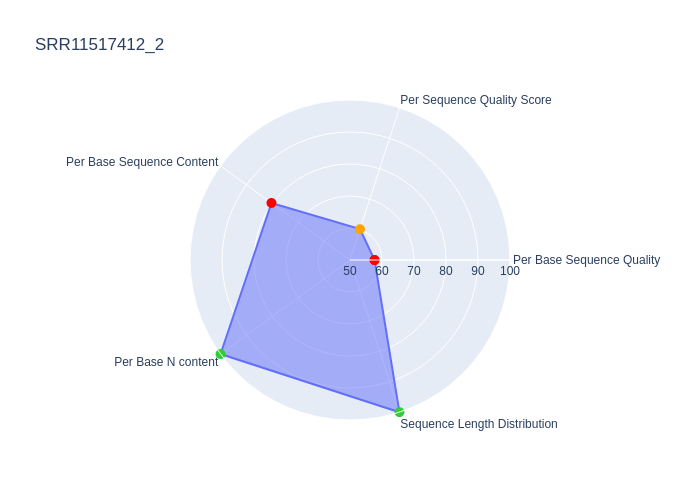

# fastQC output analysis for quality scoring
This tools' script `radar_charts.py` is a python script for the analysis and summary of fastqc outputs. It is based on the output zip files. The script first reads the `fastqc_data.txt` file module by module. Then it calculates scores for the following modules:
* per base sequence quality
* per sequence quality score
* per base sequence content
* per base N content
* sequence length distribution

The scores are calculated based on the [fastQC documentation](./src/FastQC_Manual.pdf) and range between 0-100%, with 100% being the best score for each module. These scores are visualized in a radarplot, and the total area is calculated as the final score for each raw data file and saved in a `.txt` file. The highest possible score is 23776.41. Below you can see an example output plot. The colored dots indicate the fastQC response for each module. Green indicates that fastQC returned "PASS", orange indicates "WARN", and red indicated that fastQC returned "FAIL".




## Running the tool in docker
### Testing the tool with demo data
To use this tool with demo data clone this repo and run the following commands inside the `radarcharts` directory:
```
docker build -t rchart .
docker run -v $(pwd)/outputs/:/app/outputs rchart
```

### Running the tool with your own data
You may run this with your own files. In order to do this, clone this repo. Replace the files in `inputs` with your own fastQC output zip files. They 
MUST contain the file ending `.zip`. There MUST NOT be any other `.zip` files in this directory. The zip archive itself MUST follow this structure:
```
raw_file_fastqc_name
  |- Icons/
  |- Images/
  |- fastqc.fo
  |- fastqc_data.txt
  |- fastqc_report.html
  |- summary.txt
```
You can check the structure by extracting the archive. </br>
Delete all example files from the `outputs` directory. Afterwards, run the following commands:
```
docker build -t rchart .
docker run -v $(pwd)/outputs/:/app/outputs rchart
```

## Running the tool without docker
If you want to run the tool without docker, you need the following dependencies installed:
* python v3.11.3
* pandas v1.5.3
* plotly v5.13.1
* matplotlib v3.7.3
* shapely v2.0.1
* kaleido v0.2.1
* nbformat v5.8.0
After installing the dependencies, clone this repo. Replace the files in `inputs` with your own fastQC output zip files. They 
MUST contain the file ending `.zip`. There MUST NOT be any other `.zip` files in this directory. The zip archive itself MUST follow this structure:
```
raw_file_fastqc_name
  |-Icons/
  |-Images/
  |-fastqc.fo
  |-fastqc_data.txt
  |-fastqc_report.html
  |-summary.txt
```

You can check the structure by extracting the archive. </br>
Delete all example files from the `outputs` directory. Afterwards, run the following commands:
```
python3 radar_charts.py
```
